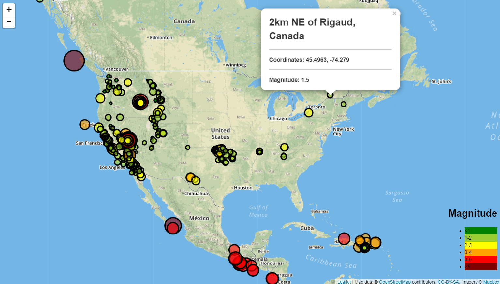

# Visualizing Data with Leaflet
This project is a part of the [Data Science Bootcamp](https://bootcamp.pe.gatech.edu/data/) at [Georgia Tech](https://bootcamp.pe.gatech.edu/).

#### -- Project Status: [Active]

## Project Intro/Objective
The purpose of this project is to map geodata and provide an intuitive way for users to find more information.

### Methods Used
* Geomapping with Leaflet
* Webpage Design
* API Request

### Technologies
* JSON
* HTML/CSS
* JavaScript
* Leaflet
* API

## Project Description
The Leaflet dependency provides a method to build geographical representations. The data being used concerns earthquakes and includes geodata, or latitude and longitude data, so using a geomapping method makes sense.
The visual for the map itself was obtained from Mapbox.com, an API for geographical information. The map built allows the user to zoom in and out and grab the map to transition. Placed on top of the map are bubbles that represent each earthquake. The size and color of the bubble correlates to the magnitute of the earthquake.
Each bubble contains further information in a tooltip pop-up about each earthquake when clicked on.

## Getting Started

1. Clone this repo (for help see this [tutorial](https://help.github.com/articles/cloning-a-repository/)).
2. Raw Data is found in the following location: 
- https://earthquake.usgs.gov/earthquakes/feed/v1.0/summary/all_week.geojson
3. Data processing/transformation scripts are being kept [here](hhttps://github.com/joja92/leaflet-challenge/tree/master/Leaflet-Step-1)
4. This project requires an API key from mapbox.com to run properly. The API key should be copied and pasted to the config.js file in the designated quoted area. The map will then run properly when the HTML file is opened.

## Contributing Members

**[Joseph Ayala](https://github.com/joja92)**

## Contact 
* Feel free to contact me with any questions or if you are interested in contributing!